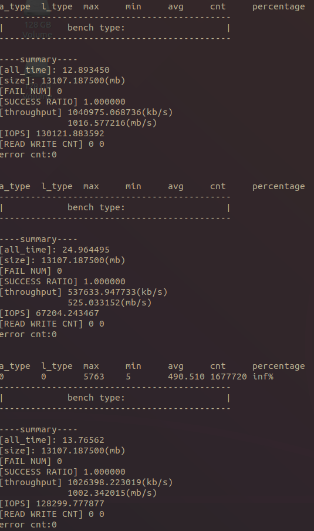
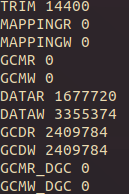
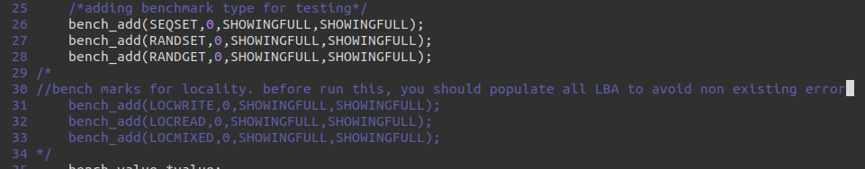

# FlashDriver
A User-space Flash Simulation Platform.

## Architecture
```
--------------------------------
|          Interface           | e.g. local, network
--------------------------------
|
--------------------------------
|          Algorithm           | e.g. PFTL, DFTL,  etc.
--------------------------------
|
--------------------------------
|            Lower             | e.g. BDBM, POSIX(file), memory(RAM Drive), etc.
--------------------------------

/*
 * Each layer is bundled to dedicated directory, - interface/ algorithm/ lower/ -
 * and implemented components of layers would be mapped on Makefile (expain it on the bottom)
 */
```

### 1. Interface
The first layer handles user requests with LPA, which means it works like block layer of kernel.  
We provide a simple micro-benchmark program on ```interface/main.c```.  

However, to test with user application such as FIO, you must forward block-level requests to this layer.  
We currently use NBD kernel module to test performance of our platform. (add details later)  


### 2. Algorithm
This layer is designed to simulate **FTL** in SSD.  
It translates LPA(from interface) to PPA(to lower) using their own mapping algorithm of each module.  
Various LPA to PPA mapping algorithms could be implemented on top of it.  
You can easily create your own FTL module with FlashDriver's form.  
(Refer algorithm/normal/ for example)

####  2.1 Add new algorithm
You can look example code in ```algorithm/Page_ftl``` with comment.
And also almost structures for this platform are defined at ```include/container.h```, you can easily understand the overall structure of this platform.


### 3. Lower
Lower layer is a mimic of physical addressing part of SSD.  
This layer forwards requests, which consists given PPA from upper layer, to selected lower module(e.g. BDBM, POSIX(file), memory(RAM Drive)).  
For example, to simulate with posix systemcall, it would call posix APIs to read/write to given address. (read(), write(), lseek())  
To implement new lower module, the target platform have to expose essential interfaces to read/write actual data.  

## How to run
### Setting
```
FlashDriver$ vim ./include/settings.h
-> set GIGAUNIT variable as device size (e.g. #define GIGAUNIT 32L for 32GB test)

FlashDriver$ vim ./interface/main.c
-> add benchmarks what you want (e.g. bench_add(SEQSET,0,RANGE,RANGE); for sequential write bench)
```

### Make new main file
```
1. copy ./interface/mainfiles/default_main.c [your_main_file]
2. edit the your main file
3. edit Makefile
original Makefile:131
driver: ./interface/mainfiles/default_main.c libdriver.a
$(CC) $(CFLAGS) -o $@ $^ $(ARCH) $(LIBS)

edited
driver: [your_main_file] libdriver.a
$(CC) $(CFLAGS) -o $@ $^ $(ARCH) $(LIBS)
```

### Makefile
```
FlashDriver$ vim Makefile
-> You can select module for each layer to operate with.

[Example]
TARGET_INF=interface
TARGET_ALGO=dftl            # Demand-based FTL
TARGET_LOWER=posix_memory   # memory(RAM Drive)
-> Make with interface as Interface module
dftl as Algorithm module
posix_memory as Lower module

* Directory name of targets must exist on each layer's directory
(e.g. algorithm/dftl/ lower/posix_memory/ )
```

### Run
```
FlashDriver$ make driver
FlahsDriver$ ./driver
```

## For DGIST students who attend Special Topic in Computer System
You should implement lasts of the ```algorithm/DFTL``` for DFTL.
There are some skeleton codes with comments.

We will grade your program by using the program log (summary, traffic) like that.


The default workload in the program are 1.Sequential write 2. random write(this will cause GC) 3.random read.
The summaries in image are the performance summaries about these three workloads


This is a traffic of all workloads issued in this system.

And Also you can modify the DRAM capacity by using ```./driver -d 'MAX_CACHINGPAGE_NUM'```
To do this, you look carefully the function named demand_get_parameter in ```algortihm/DFTL/dftl.c```
It is also the part of the requirments.

If you want to run different workload, you can modify  ```interface/mainfiles/default_main.c```.

Above three bench_add functions mean that seqwrite, randwrite, rand read each.
Commented three bench_add functions means that locality write, read, read write mixed workload each.


### Getting device accessible data structure
In case of making DFTL, you need to write/read mapping data to/from target device.

To do this, First, you get writable or readable data structure by using 'inf_get_valueset' function which is defined in ```interface/interface.c``` .

This function returns device accessible data structure called 'value_set'.

Detail of value_set is defined in ```include/container.h```

After using the assigned value_set, you should deallocate the data structure by using 'inf_free_valueset'.

```
inf_get_valueset('DATA_PTR','TYPE_OF_VALUESET','DATA_SIZE');
/*
	DATA_PTR: 
		The source of data which you want to insert to device, this is available only the TYPE_OF_REQ is write type.
		If you don't want or have any source, you can put it as NULL value. 
		When you want to get value_set for reading data, you have to set DATA_PTR to NULL.
	TYPE_OF_REQ: 
		If you want to get a value_set as write_type -> FS_SET_T
		If you want to get a value_set as read_type -> FS_GET_T
	DATA_SIZE:
		It must be 8192 which is same as PAGESIZE defined in settings.h
   */
inf_free_valueset('PTR_of_valueset', 'TYPE_OF_VALUSET');
/*
	PTR_of_valueset:
		This is the ptr of value_set which you want to deallocate.
	TYPE_OF_VALUESET:
		It is type of target value_set
   */
```

## Help
Contact to ```junsu_im@dgist.ac.kr``` or ```jinwook.bae@dgist.ac.kr```  
README would be updated someday

